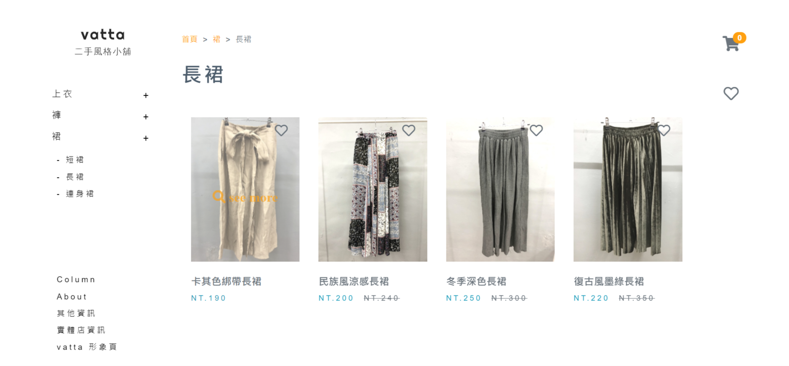
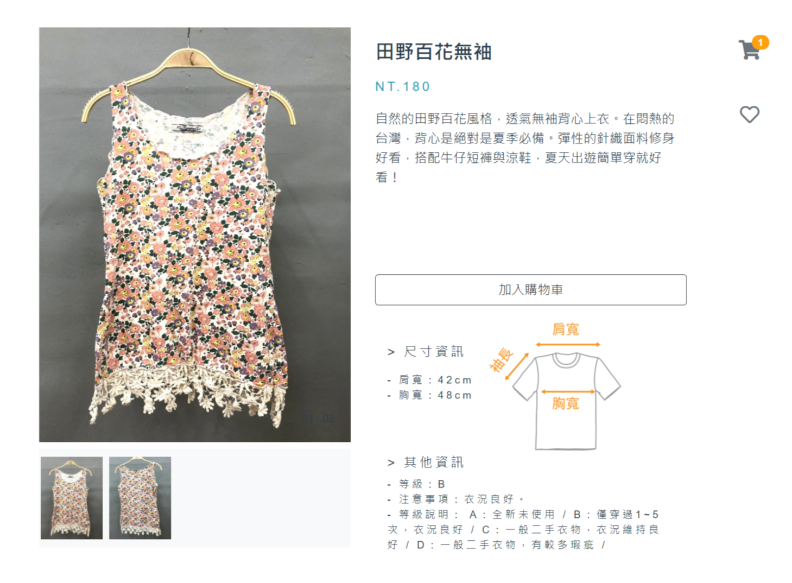
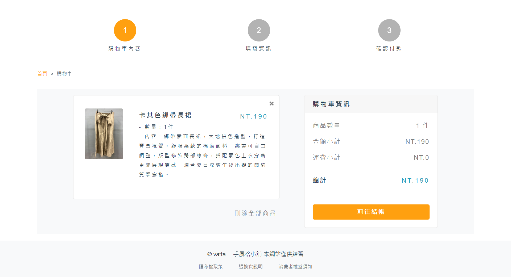
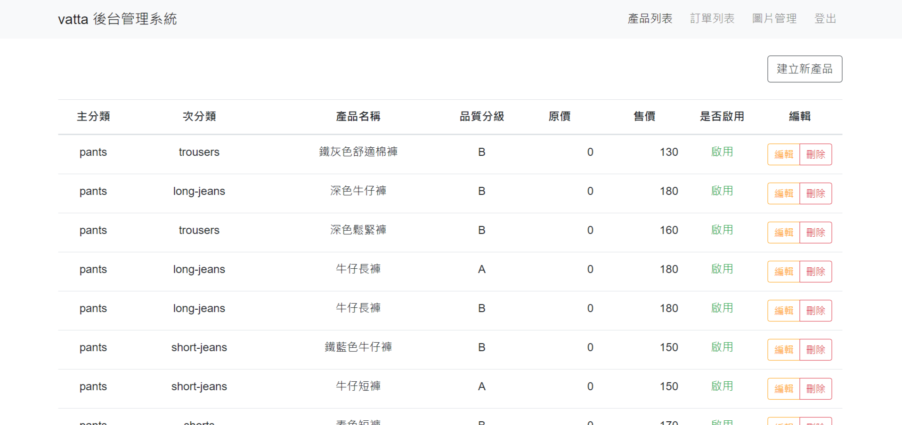
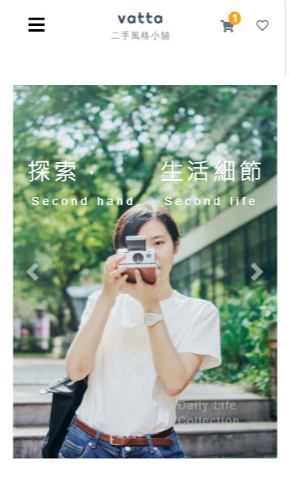

# vatta 二手風格小舖

<p>
  一件衣服，一個故事，在 Vatta 二手衣穿出妳的生活風格！
</p>
<p>
  Demo：<a  href="https://kjwen310.github.io/vatta-vintage/#/">Vatta 二手風格小舖</a>
</p>
<p>
  本專案僅作為練習，無商業用途，特別感謝 <a  href="https://www.facebook.com/clothes.telling">衣服圖書館</a> 支援圖片與文案
</p>
<p>
  
</p>


## 使用技術

- 利用 [Vue.js](https://vuejs.org/) 搭配 [Vue CLI](https://cli.vuejs.org/) 建立專案
- 利用 [axios](https://github.com/axios/axios) 處理 AJAX 請求，獲取後端資料
- 利用 [Bootstrap 4](https://getbootstrap.com/) 建立畫面 UI ，具備響應式設計
- 利用 [VeeValidate](https://vee-validate.logaretm.com/v3) 處理表單驗證
- 利用 [vue-sweetalert2](https://github.com/avil13/vue-sweetalert2) 設置提示訊息，提升使用者體驗
- 利用 [AOS](https://michalsnik.github.io/aos/) 製作視差滾動


## 特色介紹

**前台**
1. 包含Landing Page、商城、商品分類頁、商品細節頁等頁面
2. 具備關聯商品、專欄空間、分店簡介等多元區塊
3. 擁有具互動性的購物車、願望清單系統
4. 具有商品訂購紀錄、資料驗證、確認下單等功能

**後台**
1. 可進行商品的新增、修改、刪除等操作
2. 可管理訂單與圖片
3. 具備使用者驗證機制，以確保操作安全


> 可按照商品類別逐一搜尋

<p>
  
</p>

> 呈現商品細節與關連商品

<p>
  
</p>

> 具有購物車與下單系統

<p>
  
</p>

> 具有後台管理系統

<p>
  
</p>

> 支援行動裝置的RWD設計

<p>
  
</p>


## REST APIs

後端 API 由 [六角學院](https://courses.hexschool.com/)提供


---


## Project setup
```
npm install
```

### Compiles and hot-reloads for development
```
npm run serve
```

### Compiles and minifies for production
```
npm run build
```

### Lints and fixes files
```
npm run lint
```

### Customize configuration
See [Configuration Reference](https://cli.vuejs.org/config/).
